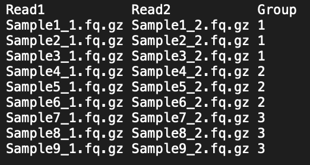

<nav>
    <ul>
      <li><a href="/RepeatProfiler/">Home</a></li>
      <li><a href="/RepeatProfiler/installation">Installation</a></li>
      <li><a href="/RepeatProfiler/gettingstarted" style="color:red">Getting Started</a></li>
      <li><a href="/RepeatProfiler/output">Output</a></li>
      <li><a href="/RepeatProfiler/application">Applications</a></li>
      <li><a href="/RepeatProfiler/documentation">Documentation</a></li>
      <li><a href="/RepeatProfiler/FAQ">FAQ</a></li>
    </ul>
</nav>

# Getting Started

## Input

To generate profiles you need two input types:

1. **Reference sequences (FASTA format)**
  - multi-fasta files are supported
  - *supported file extensions*: .fa, .fasta, .txt
2. **Short-read sequence data (FASTQ format)**
  - paired-end and single-end reads are supported
    - for paired reads, the last string before the file extension should be '_1' for Read1 and '_2' for Read2 (or '_R1' and '_R2')
  - compressed files are supported
  - *supported file extensions*: .fastq, .fq, .fastq.gz, etc.


## Generating Profiles

##### Template for Profile Command

```
repeatprof profile <'-p' for paired-end reads or '-u' for single-end> <path to reference sequence> <path of the folder containing reads> [optional flags] 
```

##### Functional Command

```sh
repeatprof profile -p Refs.fa /RepeatProfilerData/Test1
```

### Explanation
- `repeatprof` calls the program
- `profile` directs the program to generate profiles
  - see other command options in the <a href="/RepeatProfiler/documentation">documentation</a>
- `-p` indicates the input reads are paired
- `Refs.fa` specifies the path to the FASTA file contianing reference sequences 
- `/RepeatProfilerData/Test1` specifies the path of the directory containing input read files


## Example with Sample Data

Download sample input data set provided <a href="https://github.com/johnssproul/RepeatProfiler/releases/download/0.96/sample_data.zip" target="_blank">here</a>.

1. <a href="/RepeatProfiler/installation">Install</a> RepeatProfiler
2. Unzip sample data download and navigate to the folder
3. Enter the following command:

```sh
repeatprof profile -p reference.fa  <enter full path of current directory>
```

If the program runs without errors, everything should be functioning properly.

<p>For more commands and optional flags see the <a href="/RepeatProfiler/documentation">documentation</a>.</p>
  

## Correlation Analysis

If you are making profiles for multiple samples and want to compare profile shape across samples, you can use the correlation analysis feature (i.e. the -corr flag). This command is designed for cases when multiple samples per category are present (e.g., multiple individuals per species) such that -within group correlation values can be compared to -between group values. The -corr flag requires that you provide an input text file named user_groups.txt that assigns your samples to groups. The user can generate this file manually or use the program to auto-generate the base user_groups.txt file using this command:

```
repeatprof pre-corr <'-u' for unpaired reads or '-p' for paired reads> <path reads folder>
```

After running this command, the user_groups.txt will be generated based on your input reads and you can simply replace the placeholder 'TEMPORARY' with your group labels such that each sample belonging to a given group has the same label in the 'group' column. You can run this command to view the file and verify that it is in the correct format.

```sh
repeatprof pre-corr -v
```

#### Example of user_groups.txt


##### NOTE: You need to have your edited user_groups.txt in the same directory in which you are running the above command.